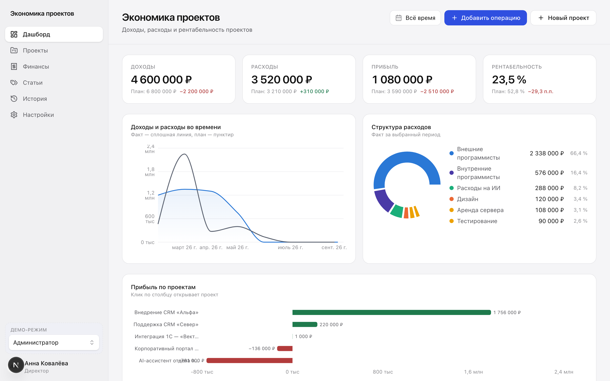
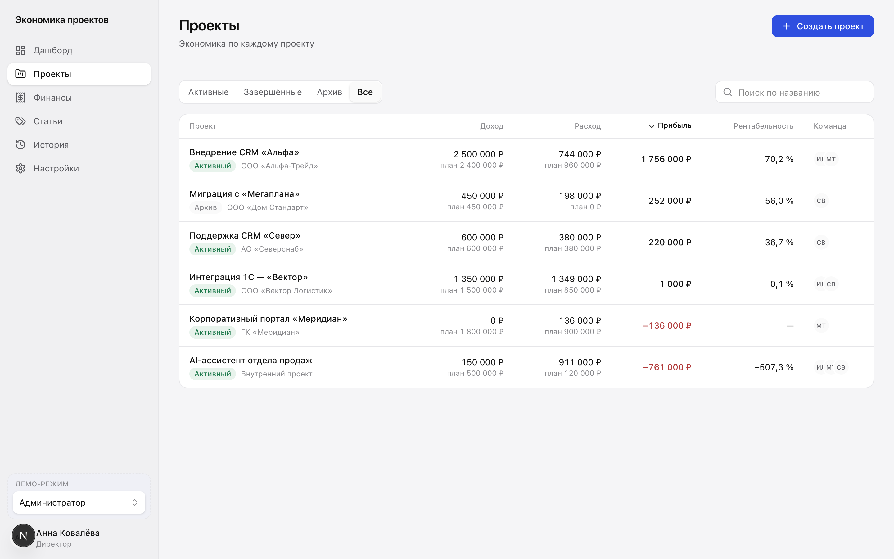
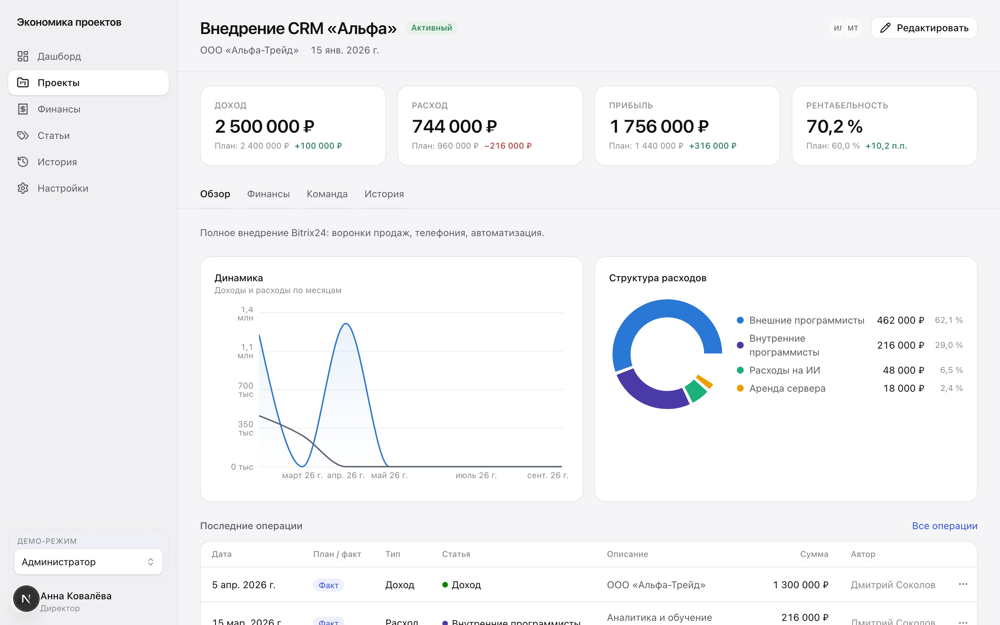
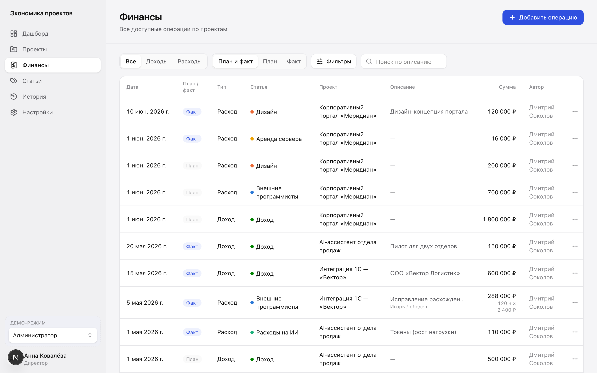
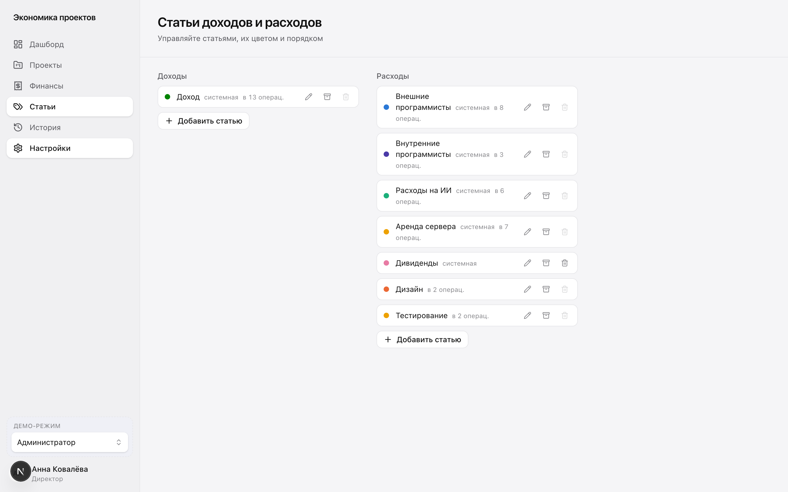
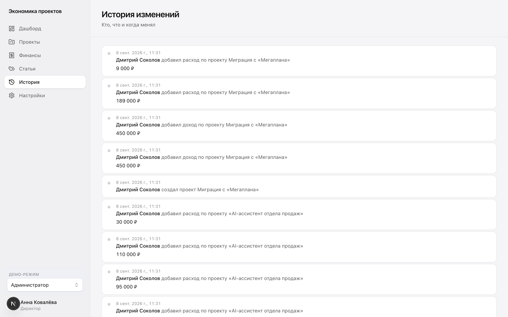
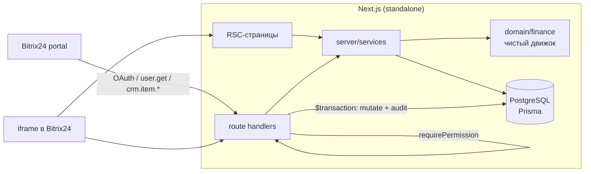

# Экономика проектов — приложение для Bitrix24

Full-stack приложение для **Bitrix24**: ручной учёт доходов и расходов по проектам,
план/факт, прибыль, рентабельность, структура расходов и команда — чтобы руководство
быстро видело экономическую эффективность каждого проекта и бизнеса в целом.

> **Живое демо:** http://159.194.205.246 — открывается сразу, переключатель ролей
> (Администратор / Руководитель / Сотрудник) слева внизу. Данные демо-портала уже
> загружены (7 проектов разной экономики). *HTTP без домена — для встраивания в
> Bitrix24 нужен поддомен + TLS, см. «Развёртывание».*

Открывается из отдельного пункта левого меню Bitrix24 (**«Экономика проектов»**),
работает как iframe-приложение. Финансы хранятся в собственной PostgreSQL; Bitrix24
используется как identity + справочник CRM.

---

## Возможности

**Работает и покрыто тестами:**

- **Проекты** — создание вручную или **импорт из Bitrix24 CRM** (Сделка / Компания
  через `crm.item.*`), статусы Активный / Завершён / Архив, участники из списка
  сотрудников Bitrix24, кнопка «Открыть в Bitrix24 ↗».
- **Финансовые операции** — доходы и расходы, **PLAN и FACT — отдельные записи**,
  фиксированная сумма или **часы × ставка** (итог пересчитывается на сервере, snapshot
  часов/ставки сохраняется), soft-delete, дополнительные поля (контрагент, счёт,
  документ) скрыты за «Дополнительные данные».
- **Статьи** доходов/расходов — CRUD, цвет из палитры, порядок; использованную статью
  нельзя удалить, только архивировать (исторические операции продолжают её показывать).
- **Дашборд** — 4 KPI (крупный факт, план, отклонение; для рентабельности — п.п.),
  3 графика (доходы/расходы во времени, прибыль по проектам, структура расходов),
  таблица проектов, пресеты периода (месяц/квартал/год/всё время/произвольный),
  состояние фильтров в URL.
- **Карточка проекта** — шапка + 4 KPI (план/факт), вкладки Обзор / Финансы / Команда /
  История.
- **История изменений** (`/history`, `/projects/[id]/history`) — человекочитаемый вид
  (`Иван Петров изменил расход проекта «Альфа»`, `25 000 ₽ → 32 000 ₽`), без сырого JSON.
- **Роли** ADMIN / MANAGER / EMPLOYEE — проверяются **на бэкенде** на каждом запросе.
- **Demo Mode** — весь функционал без Bitrix24, с переключателем ролей.
- **Bitrix24 integration** — OAuth install/handler, шифрование токенов AES-256-GCM,
  синхронизация сотрудников (`user.get`), CRM-браузер, обработка `ONAPPUNINSTALL`.

## Скриншоты

| Дашборд | Проекты |
|---|---|
|  |  |

| Карточка проекта | Финансы |
|---|---|
|  |  |

| Статьи | История |
|---|---|
|  |  |

## Стек

| | |
|---|---|
| Frontend / Backend | Next.js 16 (App Router), TypeScript strict, React 19 |
| БД | PostgreSQL, Prisma ORM, деньги `Decimal(18,2)` |
| UI | Tailwind CSS v4, Radix UI primitives, Lucide, Recharts |
| Формы | React Hook Form + Zod |
| Auth | `jose` (подписанный cookie), AES-256-GCM для токенов Bitrix |
| Тесты | Vitest (unit + integration на реальной PostgreSQL), Playwright (E2E) |
| Инфра | Docker, Docker Compose, standalone Next server, nginx (пример) |

## Архитектура



- `src/domain/finance/` — **единственный источник финансовых формул**: чистые функции,
  `Decimal` на входе, `Decimal | null` на выходе, ноль зависимостей от БД и React.
- `src/lib/db/with-portal.ts` — каждый запрос портал-скоупится `portalId` (изоляция
  порталов).
- `src/server/handler.ts` — `route()`: CSRF → сессия → права → домен →
  `$transaction(мутация + audit)` → маппинг ошибок в человеческие сообщения.
- `src/lib/format/` — единственное место, где живёт `₽` и `Intl.NumberFormat('ru-RU')`.

Подробнее: [docs/DECISIONS.md](docs/DECISIONS.md), [docs/DESIGN.md](docs/DESIGN.md).

## Быстрый старт — Demo

Нужен только Docker. **Без конфигурации:**

```bash
git clone <repo> && cd project-economics
docker compose up --build
```

Откройте <http://localhost:3000>. В demo-режиме контейнер сам генерирует временные
секреты, применяет миграции и наполняет демо-портал (7 проектов: прибыльный,
убыточный, точно по плану, с перерасходом, без факт-дохода, завершённый, архивный). В левом нижнем
углу — переключатель ролей **Администратор / Руководитель / Сотрудник**.

> Временные секреты живут до перезапуска (сессии сбрасываются). Для постоянного
> demo или реальной установки задайте `SESSION_SECRET` и `APP_ENCRYPTION_KEY` в `.env`
> (`cp .env.example .env`, затем `openssl rand -base64 48` / `openssl rand -base64 32`).

## Локальная разработка

```bash
npm install
cp .env.example .env                # заполните SESSION_SECRET, APP_ENCRYPTION_KEY
docker compose up -d db              # PostgreSQL для разработки
npm run db:migrate                   # prisma migrate dev
npm run db:seed                      # демо-портал
npm run dev                          # http://localhost:3000
```

Для интеграционных тестов нужна отдельная БД:

```bash
docker compose -f docker-compose.test.yml up -d   # PostgreSQL на :5433
npm test                                           # unit + integration
npm run test:e2e                                   # Playwright (собирает и запускает прод-сервер)
```

## Переменные окружения

| Переменная | Назначение |
|---|---|
| `DATABASE_URL` | строка подключения PostgreSQL |
| `APP_URL` | публичный URL приложения (OAuth redirect, ссылки на CRM) |
| `SESSION_SECRET` | подпись session-cookie — `openssl rand -base64 48` |
| `APP_ENCRYPTION_KEY` | ключ AES-256-GCM для токенов Bitrix — `openssl rand -base64 32` (ровно 32 байта) |
| `B24_CLIENT_ID` / `B24_CLIENT_SECRET` | из local-приложения Bitrix24 |
| `DEMO_MODE` | `true` — работа без Bitrix24 + переключатель ролей; `false` для реальной установки |
| `TEST_DATABASE_URL` | БД для интеграционных тестов (`docker-compose.test.yml`, порт 5433) |

## Установка в Bitrix24

1. **Разработка приложений → Другое → Локальное приложение** (или Маркет → добавить своё).
2. Тип: **Серверное** (нужен `crm.item.*` и OAuth), «Использовать API» + встраивание.
3. **Адрес обработчика:** `https://<APP_URL>/api/bitrix/handler`
4. **URL первоначальной установки:** `https://<APP_URL>/api/bitrix/install`
5. **Права (scope):** `crm`, `placement`, `user_brief`, `basic`.
6. Скопируйте `client_id` → `B24_CLIENT_ID`, `client_secret` → `B24_CLIENT_SECRET`,
   поставьте `DEMO_MODE=false`, перезапустите `docker compose up -d`.
7. Нажмите **Установить**. Обработчик установки сохранит зашифрованные токены, создаст
   стартовые статьи и привяжет пункт левого меню **«Экономика проектов»** через
   `placement.bind` (`LEFT_MENU`).
8. **Проверка:** пункт «Экономика проектов» появился в левом меню; при открытии
   `/api/bitrix/handler` определяет текущего пользователя (`user.current`), администратор
   Bitrix24 распознаётся как ADMIN.
9. События: подпишите `ONAPPUNINSTALL` на `https://<APP_URL>/api/bitrix/events`.

## Docker

`docker compose up --build` поднимает `db` (PostgreSQL 17) и `app`. Контейнер `app` при
старте выполняет `prisma migrate deploy` (**не** `db push`), затем в demo-mode —
идемпотентный seed, затем standalone-сервер. Оба сервиса имеют healthcheck.

## Развёртывание на VPS

Одной командой из корня репозитория:

```bash
bash deploy/vps-setup.sh
```

Скрипт создаёт `.env` со сгенерированными секретами, собирает и поднимает стек
(app + PostgreSQL), дожидается healthcheck. Дальше — nginx как reverse-proxy с TLS
(`deploy/nginx.example.conf`, CSP `frame-ancestors` для доменов Bitrix24), правка
`.env` под реальный портал (`APP_URL`, `B24_CLIENT_ID/SECRET`, `DEMO_MODE=false`) и
`docker compose up -d --build`. Подробно — [deploy/README.md](deploy/README.md).
Обновление: `git pull && docker compose up -d --build` (миграции применяются на старте
контейнера).

## Тесты

```
npm run lint         # ESLint
npm run typecheck    # tsc --noEmit (strict)
npm test             # Vitest: 32 файла, 186 тестов (unit + integration на реальной PG)
npm run test:e2e     # Playwright: smoke + полный сценарий ТЗ §67
npm run build        # next build (standalone)
```

Матрицы и ручные проверки — [docs/TESTING.md](docs/TESTING.md).
Что делалось с помощью ИИ и как проверялось — [AI_USAGE.md](AI_USAGE.md).

## Финансовые формулы

```
Фактический доход   = Σ FACT INCOME
Фактические расходы  = Σ FACT EXPENSE
Фактическая прибыль  = Фактический доход − Фактические расходы

Плановый доход       = Σ PLAN INCOME       (аналогично для расходов и плановой прибыли)

Рентабельность = Прибыль / Доход × 100
    при Доход = 0  →  null  (в UI «—», не Infinity/NaN/0%)

Отклонение (доход/расход/прибыль) = FACT − PLAN
Отклонение рентабельности          = FACT margin − PLAN margin   → в п.п. («+4,2 п.п.»)

Часы × ставка: Сумма = round₂(часы × ставка)   — всегда пересчитывается на сервере
```

Все вычисления — на `Decimal` (`0.1 + 0.2` в финансовой логике исключён, есть тест).

## Роли — матрица прав (проверяется на бэкенде)

| Возможность | ADMIN | MANAGER | EMPLOYEE |
|---|:---:|:---:|:---:|
| Видеть все проекты | ✓ | ✓ | только свои |
| Видеть финпоказатели проекта | ✓ | ✓ | ✓ (в доступном проекте) |
| Создавать / редактировать проект | ✓ | ✓ | — |
| Архивировать / восстанавливать проект | ✓ | ✓ | — |
| Создавать / править / удалять операции | ✓ | ✓ | — |
| Управлять участниками проекта | ✓ | ✓ | — |
| Управлять статьями | ✓ | ✓ | — |
| Смотреть историю | ✓ | ✓ | — (только обзор своего проекта) |
| Назначать роли MANAGER / EMPLOYEE | ✓ | — | — |
| Настройки интеграции / установка | ✓ | — | — |

`GET /api/projects/:id` для сотрудника-не-участника → **403**. Любая мутация финансов
сотрудником → **403**. Подделанная роль в cookie игнорируется — роль берётся из БД.
